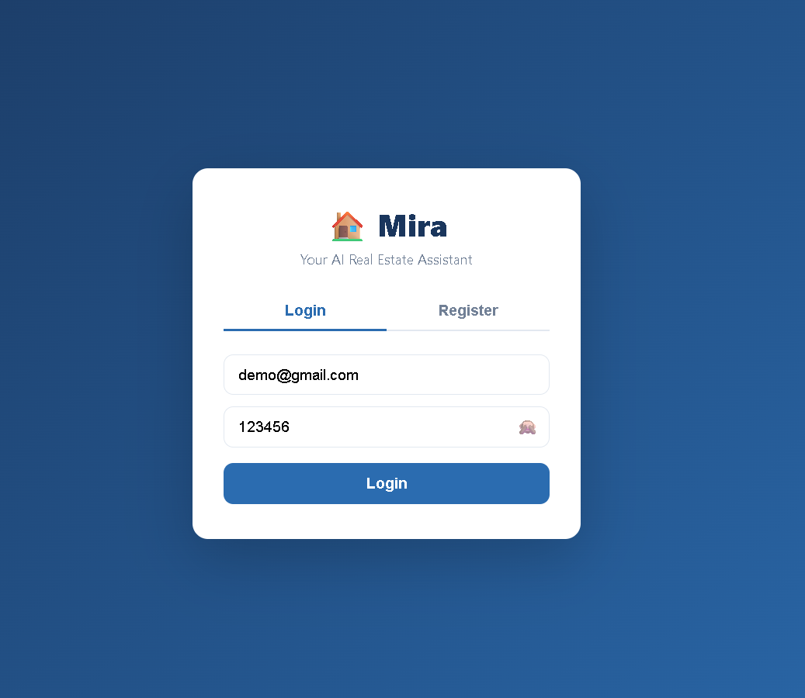
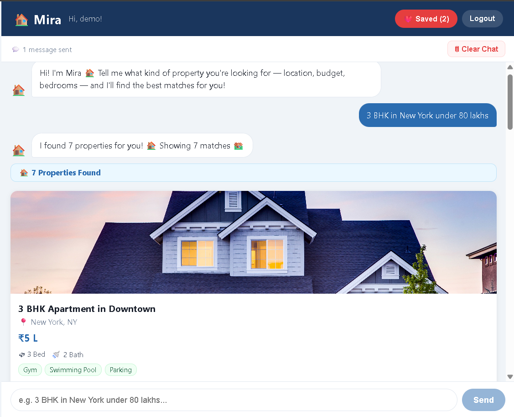
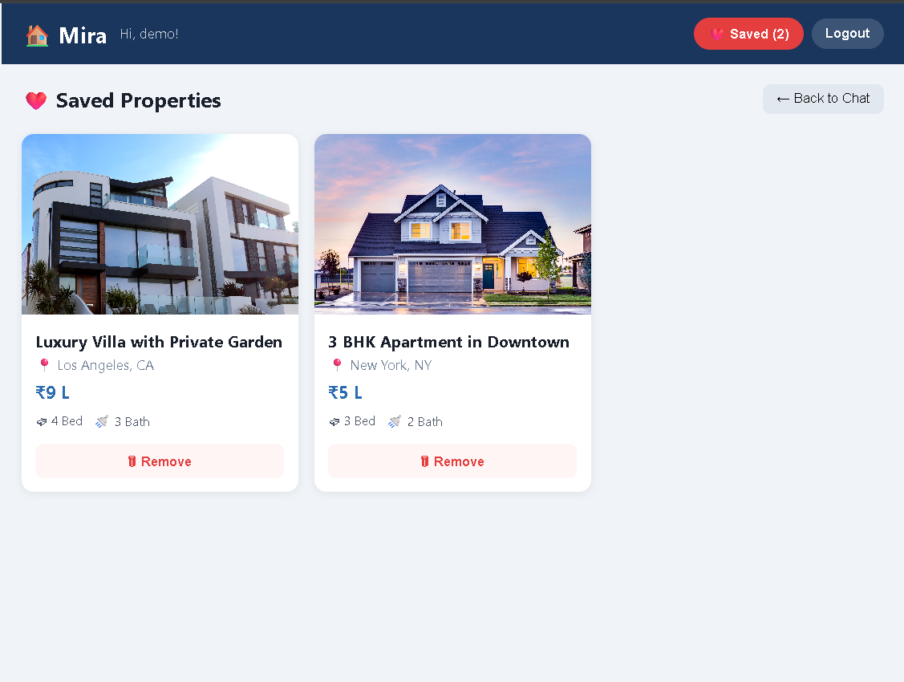

# 🏠 Mira — AI Real Estate Chatbot

> A full-stack MERN chatbot that helps users find their perfect home through natural conversation.

Mira accepts plain-English queries like *"3 BHK in New York under 80 lakhs with a gym"*, merges data from three separate JSON sources, filters matching properties in real time, and presents them as rich cards — all inside a clean chat interface. Users can register, log in, save favourite properties, and return to their full chat history on their next visit.

---

## 📸 Screenshots

### Authentication — Login & Register


### Chat Interface — Search & Results


### Saved Properties Panel


---

## ✨ Features

### Core
| Feature | Details |
|---|---|
| 💬 **Conversational Chat UI** | Message bubbles, bot avatar, suggestion chips on first load |
| 🔍 **Natural Language Search** | Understands location, budget (lakhs/crores), BHK, amenities from plain text |
| 🗄️ **3-Source Data Merge** | Joins `property_basics`, `property_characteristics`, and `property_images` by `id` at startup |
| 🏡 **Property Cards** | Image, price (auto-formatted to L/Cr), beds, baths, size, amenity tags |
| 💾 **Save Properties** | One click to save; stored in MongoDB against your account |
| 🗂️ **Saved Panel** | View and remove all your saved properties from a dedicated panel |

### Authentication & Security
| Feature | Details |
|---|---|
| 🔐 **JWT Authentication** | 7-day tokens stored in localStorage; sent as `Bearer` header on every request |
| 🔑 **Password Hashing** | bcrypt with salt rounds = 10 |
| 👤 **User-Specific Data** | Saved properties and chat history are isolated per user — other users cannot access yours |
| 🛡️ **Protected Routes** | All `/api/saved` and `/api/history` endpoints require a valid JWT |

### Chat History
| Feature | Details |
|---|---|
| 📜 **Persistent History** | Every message you send and every bot reply is saved to MongoDB |
| ♻️ **Auto-Restore** | On login, your previous conversation is loaded automatically |
| 🗑️ **Clear Chat** | Wipes messages from the UI and deletes them from the database |

### UX Polish
| Feature | Details |
|---|---|
| ⏳ **Skeleton Loading** | 3 shimmer placeholder cards animate while the search runs |
| 🔔 **Toast Notifications** | `❤️ Property saved!` and `🗑 Chat cleared` pop up and fade automatically |
| 🏘️ **Result Count Badge** | `🏠 5 Properties Found` header above every result set |
| 📍 **Smart Scroll** | Scrolls to the top of new results, not the bottom, so you see the count first |
| 🖼️ **Image Fallback** | If a property image fails to load, a 🏠 placeholder is shown instead |
| 💬 **Message Counter** | Toolbar shows how many messages you've sent in this session |

---

## 🏗️ Architecture & Data Flow

```
User types: "3 BHK in Delhi under 80 lakhs with gym"
         │
         ▼
   React Frontend (Vite)
   ChatWindow.jsx
   POST /api/chat  ──── Bearer token in header
         │
         ▼
   Express Backend
   routes/chat.js
         │
         ├──► parseQuery.js
         │    Regex extraction:
         │    location  → "Delhi"
         │    bedrooms  → 3
         │    maxBudget → 8,000,000
         │    amenities → ["gym"]
         │
         ├──► mergeData.js → filterProperties()
         │    In-memory merged array (loaded once at startup)
         │    Filters by all extracted criteria
         │
         ▼
   Returns: { reply, properties[], filters }
         │
         ▼
   React renders PropertyCard per result
   User clicks Save
         │
         ▼
   POST /api/saved  ──── Bearer token
   Middleware: protect() verifies JWT → attaches req.user
   SavedProperty saved with userId = req.user._id
         │
         ▼
   MongoDB Atlas / Local
   Collections: users · savedproperties · chatmessages
```

### How the 3-Source Merge Works

At server startup, `mergeData.js` loads all three JSON files **once** and joins them by `id` into a single in-memory array:

```
property_basics.json          →  id, title, price, location
property_characteristics.json →  id, bedrooms, bathrooms, size, amenities
property_images.json          →  id, image_url

        All three joined by id
                  ↓
        mergedProperties[]  (cached in memory)
```

Each subsequent search hits this in-memory array — **no database query, no file I/O** — making filtering near-instant regardless of dataset size.

### How Search Filtering Works

`parseQuery.js` uses pure regex — no AI, no external API — to extract structured filters from free text:

| Input example | Extracted filter |
|---|---|
| `"3 BHK"` / `"3 bedroom"` / `"three bhk"` | `bedrooms: 3` |
| `"under 80 lakhs"` / `"below 80L"` | `maxBudget: 8000000` |
| `"above 1 crore"` / `"over 1Cr"` | `minBudget: 10000000` |
| `"around 50 lakhs"` (no qualifier) | `minBudget: 4000000, maxBudget: 6000000` (±20%) |
| `"in Delhi"` / `"Mumbai"` | `location: "Delhi"` |
| `"with gym"` / `"pool"` / `"parking"` | `amenities: ["gym"]` |

`filterProperties()` then runs AND logic across all extracted filters — every condition must pass for a property to appear in results.

---

## 📁 Folder Structure

```
mira-chatbot/
│
├── .env                          ← secrets (never commit)
├── .env.example                  ← template for teammates
├── .gitignore
├── README.md
│
├── screenshots/                  ← UI screenshots for README
│   ├── auth.png
│   ├── chat.png
│   └── saved.png
│
├── server/                       ← Node.js + Express backend
│   ├── index.js                  ← app entry, DB connection, route registration
│   │
│   ├── data/                     ← ⬅️ place your 3 JSON files here
│   │   ├── property_basics.json
│   │   ├── property_characteristics.json
│   │   └── property_images.json
│   │
│   ├── middleware/
│   │   └── auth.js               ← JWT verification, attaches req.user
│   │
│   ├── models/
│   │   ├── User.js               ← email, hashed password, timestamps
│   │   ├── SavedProperty.js      ← property snapshot linked to userId
│   │   └── ChatMessage.js        ← chat messages linked to userId
│   │
│   ├── routes/
│   │   ├── auth.js               ← POST /api/auth/register & /login
│   │   ├── chat.js               ← POST /api/chat (search)
│   │   ├── saved.js              ← GET / POST / DELETE /api/saved
│   │   └── chatHistory.js        ← GET / POST / DELETE /api/history
│   │
│   └── utils/
│       ├── mergeData.js          ← loads + joins 3 JSONs, filterProperties()
│       └── parseQuery.js         ← regex NLP: text → structured filters
│
└── client/                       ← React frontend (Vite)
    ├── index.html
    ├── vite.config.js            ← dev proxy: /api → localhost:5000
    ├── package.json
    │
    └── src/
        ├── main.jsx              ← React root, wraps app in <AuthProvider>
        ├── App.jsx               ← auth gate, header, panel switching
        ├── index.css             ← all global styles
        │
        ├── context/
        │   └── AuthContext.jsx   ← user state, token, login(), logout()
        │
        ├── pages/
        │   └── AuthPage.jsx      ← login / register tabs
        │
        └── components/
            ├── ChatWindow.jsx    ← message list, input bar, history load/save
            ├── MessageBubble.jsx ← individual chat bubble (user / bot)
            ├── PropertyCard.jsx  ← property result card with save button
            ├── SavedPanel.jsx    ← grid of saved properties with remove button
            ├── SkeletonCard.jsx  ← shimmer placeholder while loading
            └── Toast.jsx         ← auto-dismissing notification popup
```

---

## ⚙️ Local Setup

### Prerequisites

- Node.js v18+
- MongoDB running locally **or** a free [MongoDB Atlas](https://www.mongodb.com/atlas) cluster
- Git

### 1. Clone the repository

```bash
git clone https://github.com/your-username/mira-chatbot.git
cd mira-chatbot
```

### 2. Add your JSON data files

Place your three property data files inside `server/data/`:

```
server/data/property_basics.json           ← { id, title, price, location }
server/data/property_characteristics.json  ← { id, bedrooms, bathrooms, size, amenities[] }
server/data/property_images.json           ← { id, image_url }
```

> All three files are joined by the `id` field. Make sure IDs match across files.

### 3. Configure environment variables

```bash
cp .env.example .env
```

Open `.env` and fill in your values:

```env
# MongoDB — local or Atlas
MONGO_URI=mongodb://localhost:27017/mira
# For Atlas:
# MONGO_URI=mongodb+srv://<user>:<password>@cluster.mongodb.net/mira

# Express server port
PORT=5000

# Your React dev URL (Vite default)
CLIENT_URL=http://localhost:5173

# JWT secret — change this to a long random string in production
JWT_SECRET=mira_super_secret_key_change_in_production
```

### 4. Install dependencies

```bash
# Backend
cd server
npm install

# Frontend
cd ../client
npm install
```

### 5. Run in development

Open **two terminals**:

```bash
# Terminal 1 — Backend
cd server
npm run dev
# ✅ MongoDB connected
# 🚀 Server running on port 5000

# Terminal 2 — Frontend
cd client
npm run dev
# ➜  Local: http://localhost:5173
```

Open **http://localhost:5173** in your browser.

### 6. First-time use

1. Click **Register** and create an account
2. You'll be logged in automatically and land on the chat screen
3. Type a query or click a suggestion chip
4. Click 🤍 **Save** on any property card you like
5. Click **❤️ Saved** in the header to view your saved properties
6. Log out and log back in — your chat history and saved properties will still be there

---

## 🌐 API Reference

### Auth

| Method | Endpoint | Body | Auth | Description |
|---|---|---|---|---|
| POST | `/api/auth/register` | `{ name, email, password }` | ❌ | Create account, returns JWT |
| POST | `/api/auth/login` | `{ email, password }` | ❌ | Login, returns JWT |

### Chat

| Method | Endpoint | Body | Auth | Description |
|---|---|---|---|---|
| POST | `/api/chat` | `{ message }` | ✅ | Parse query, return matching properties |

### Saved Properties

| Method | Endpoint | Body | Auth | Description |
|---|---|---|---|---|
| GET | `/api/saved` | — | ✅ | Get all saved properties for logged-in user |
| POST | `/api/saved` | property object | ✅ | Save a property |
| DELETE | `/api/saved/:id` | — | ✅ | Remove a saved property |

### Chat History

| Method | Endpoint | Body | Auth | Description |
|---|---|---|---|---|
| GET | `/api/history` | — | ✅ | Load user's full chat history |
| POST | `/api/history` | `{ messages[] }` | ✅ | Persist new messages |
| DELETE | `/api/history` | — | ✅ | Clear all chat history for this user |

> All protected routes require `Authorization: Bearer <token>` in the request header.

---

## 🗃️ MongoDB Collections

### `users`
```js
{
  _id, name, email,
  password,      // bcrypt hashed, never returned in responses
  createdAt, updatedAt
}
```

### `savedproperties`
```js
{
  _id, userId,   // ref → users._id
  propertyId, title, price, location,
  bedrooms, bathrooms, size,
  amenities[], images[],
  createdAt, updatedAt
  // Unique index on: { propertyId, userId }
}
```

### `chatmessages`
```js
{
  _id, userId,   // ref → users._id
  from,          // "user" | "bot"
  text, type,    // "text" | "properties"
  properties[],  // populated for type="properties"
  createdAt, updatedAt
  // Index on: { userId, createdAt }
}
```

---

## 📦 Tech Stack

| Layer | Technology |
|---|---|
| Frontend | React 18, Vite, Axios |
| Backend | Node.js, Express |
| Database | MongoDB, Mongoose |
| Auth | JSON Web Tokens (jsonwebtoken), bcryptjs |
| Data | 3 static JSON files merged in-memory |
| Styling | Plain CSS with CSS variables |
| Dev tooling | Nodemon, Vite dev proxy |

---

## 🚀 Deployment

### Backend → Render (free tier)

1. Push your code to GitHub
2. Go to [render.com](https://render.com) → New Web Service → connect your repo
3. Set **Root Directory** to `server`
4. Set **Build Command** to `npm install`
5. Set **Start Command** to `npm start`
6. Add all `.env` variables in the Render dashboard Environment tab

### Frontend → Vercel (free tier)

1. Go to [vercel.com](https://vercel.com) → New Project → connect your repo
2. Set **Root Directory** to `client`
3. Add environment variable: `VITE_API_URL=https://your-render-app.onrender.com`
4. Update `vite.config.js` proxy target to your Render URL for production builds

### Database → MongoDB Atlas (free M0 cluster)

1. Create a free cluster at [mongodb.com/atlas](https://www.mongodb.com/atlas)
2. Whitelist `0.0.0.0/0` in Network Access (allows Render's dynamic IPs)
3. Copy the connection string and set it as `MONGO_URI` in Render

---

## 🔮 Possible Future Enhancements

- **Claude / OpenAI NLP** — replace regex parser with an LLM call for smarter, more flexible query understanding
- **Property Comparison** — select multiple properties and view them side by side
- **Real-time Search** — debounced live filtering as the user types
- **Map View** — plot results on an interactive map using Leaflet or Google Maps
- **Admin Panel** — add/edit/delete properties without touching JSON files

---

## 📝 Approach & Challenges

**Approach**

The project is deliberately kept simple on the data layer — three flat JSON files instead of a seeded database. This made the merge logic the interesting engineering challenge: building O(1) lookup maps by `id` so the join is fast even with hundreds of properties, then caching the result so it runs exactly once per server lifecycle.

For search, pure regex was chosen over an AI API call to keep the search path synchronous and dependency-free. The parser handles the specific patterns Indian real estate queries follow — lakhs/crores, BHK notation, common city names — which covers the vast majority of real user input.

Auth was added with the minimal footprint principle: JWT in localStorage, a single middleware function, and the `userId` field threaded through the existing Mongoose schemas. No session management, no refresh tokens, no OAuth — just what the use case needs.

**Challenges**

- **Data type mismatch** — the JSON files used numeric `id` fields while the merge utility compared them as strings. Solved by wrapping all IDs in `String()` before map lookups.
- **Image field naming** — the JSON used `image_url` (singular string) while the initial code expected `images` (array). Updated `PropertyCard.jsx` to read `property.image_url` directly.
- **Chat persistence on panel switch** — navigating to the Saved panel unmounted `ChatWindow`, triggering a fresh history fetch and losing unsaved in-memory state. Solved by keeping `ChatWindow` always mounted and toggling visibility with CSS `display: none`.